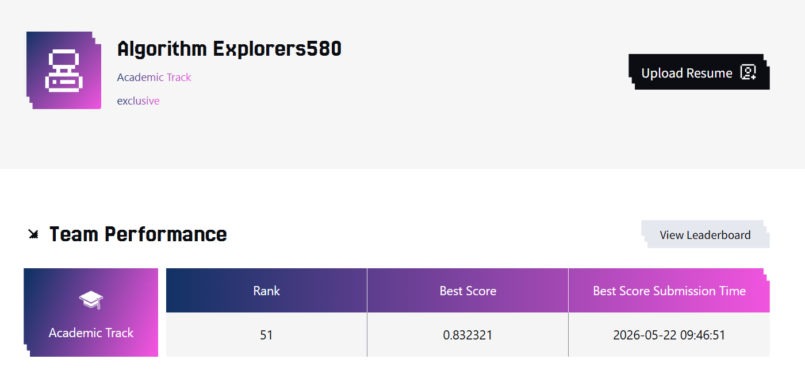

# Rank51-2026TAAC-KDDCUP

[](https://github.com/Rongfeng-Guo/Rank51-TAAC2026-KDDCUP/actions/workflows/repo-checks.yml)

本仓库为队伍 **exclusive** 在腾讯广告算法大赛 2026 Academic Track 的开源代码。最终线上分数为 **0.832321**，排名 **51**。主要围绕时间特征、序列兴趣匹配、训练样本时间窗口、用户 dense 特征处理和稀疏参数训练稳定性做了迭代。
最终成绩：


部分历史成绩：


PCVR 任务里，用户转化行为有明显的时间规律，也有很强的候选广告相关性。用户在不同小时、不同星期的活跃状态会变化，历史行为发生的时间也会影响当前请求的解释方式；同时，转化判断既需要用户整体兴趣，也需要当前广告命中用户历史里的某些兴趣片段。训练数据也存在时间分布漂移，过早的样本会给最终提交分布带来噪声。基于这些观察，这版代码把主要精力放在三个方向：

- 建模当前样本和历史序列里的周期时间信息。
- 用候选广告引导历史序列池化，增强广告和用户历史的匹配。
- 使用 recent-window 训练策略，让训练分布贴近提交阶段的样本分布。

## 默认运行

### 环境依赖

建议使用 Python 3.10+、PyTorch 2.x 和 CUDA GPU 环境。最小依赖可以通过：

```bash
pip install -r requirements.txt
```

本仓库只包含代码、配置和方案说明，不包含腾讯广告算法大赛原始数据。运行前需要按官方数据包保持 `schema.json` 与 parquet 文件可访问。

### 数据与路径约定

训练入口会读取环境变量中的路径，常用设置如下：

```bash
export TRAIN_DATA_PATH=/path/to/train_parquet_dir
export EVAL_DATA_PATH=/path/to/eval_parquet_dir
export MODEL_OUTPUT_PATH=/path/to/ckpt_dir
```

`TRAIN_DATA_PATH` 和 `EVAL_DATA_PATH` 对应的目录应包含 `*.parquet` 和 `schema.json`。默认训练脚本会在仓库目录下创建 `ckpt/`、`log/` 和 `events/`。这些目录属于运行产物，不应提交到 Git。

```bash
bash run.sh
```

`run.sh` 默认使用提交时的配置：

```text
num_epochs=7
publish_epochs=1,2,4,5,6,7
split_mode=overlap_tail
train_recent_ratio=0.90
valid_ratio=0.016
query_pooling=mean_din
use_periodic_time_ns=True
use_seq_periodic_hour_day_sideinfo=True
use_user_dense_group_projector=True
d_model=72
seq_hash_allowlist=seq_b:69,seq_c:29,34,47
seq_hash_bucket_size=500000
seq_hash_gate_init=-0.75
```

常用参数可以通过环境变量覆盖：

```bash
TRAIN_RECENT_RATIO=0.85 SEQ_HASH_BUCKET_SIZE=50000 bash run.sh
```

## 1. 样本级周期时间特征

广告转化会受到小时、星期和工作/休息节奏影响。代码中加入了样本级周期时间特征，让模型在处理当前请求时知道这个样本发生在一天和一周中的什么位置。

具体实现在 `dataset.py` 中，通过 `--use_periodic_time_ns` 开启。数据侧从样本 `timestamp` 派生 4 个 synthetic user int 特征：

```text
hour_id          1-24
day_id           1-7
weekend_id       1-2
time_bucket_id   1-4
```

对应保留 fid：

```python
PERIODIC_TIME_NS_FIDS = (1_200_001, 1_200_002, 1_200_003, 1_200_004)
```

这些字段不会改动数据 schema 文件，而是在加载 schema 时动态追加。`train.py` 会把它们合并到最后一个 User NS group 中，保持 User NS token 数量稳定。

这个设计让时间信息通过普通 categorical embedding 进入 User NS token。模型可以学习不同时段下用户活跃、点击和转化倾向的差异。

## 2. 序列级 hour/day side-info

只知道当前样本时间还不够，历史行为发生的时间也很重要。用户在白天和晚上产生的行为，可能对应不同兴趣场景；工作日和周末的行为，也可能对应不同转化意图。

代码中通过 `--use_seq_periodic_hour_day_sideinfo` 给每个序列事件追加两个 synthetic side-info：

```text
SEQ_PERIODIC_HOUR_FID = 1_400_001
SEQ_PERIODIC_DAY_FID  = 1_400_002
```

实现上先从序列 timestamp 推导本地 hour/day，再和已有序列 side-info 一起进入 embedding 和序列投影路径。这样历史行为 token 自身就带有发生时间，后续序列编码器和 query pooling 都可以使用这部分信息。

## 3. 序列 DIN pooling

PCVR 判断里，候选广告和用户历史之间的匹配关系很关键。用户历史序列中通常只有一部分行为和当前广告相关，直接使用平均池化会把相关行为和无关行为混在一起。

代码中在 `MultiSeqQueryGenerator` 里加入了 `mean_din` 模式：

```bash
--query_pooling mean_din
--din_dropout 0.05
```

对于每个序列 token，DIN scorer 使用候选广告 token 和历史 token 构造匹配特征：

```python
[item_query, seq_token, item_query - seq_token, item_query * seq_token]
```

然后对序列 token 打分并加权求和，得到 item-conditioned 的历史兴趣表示。这个表示会和普通 masked mean pooling 一起参与 query token 生成。

这一步的动机是让 query 生成阶段提前看到“当前广告应该关注哪段历史”。后续 HyFormer block 再处理序列时，query token 已经带有候选广告引导过的历史摘要。

## 4. Recent-window

PCVR 数据有时间漂移，较早样本里的用户行为、广告分布和转化环境会逐渐变化。最终提交聚焦最近分布，所以训练阶段加入 recent-window 样本过滤。

提交配置：

```bash
--split_mode overlap_tail
--train_recent_ratio 0.90
--valid_ratio 0.016
```

`dataset.py` 会扫描主样本 `timestamp`，按分位数找到时间阈值：

- `train_recent_ratio=0.90`：训练保留 timestamp 最新的 90% 样本。
- `valid_ratio=0.016`：监控集使用 timestamp 最新的 1.6% 样本。
- `overlap_tail`：监控样本也保留在训练流中，用于 final-fit 场景下观察训练状态。

这部分是数据策略，不改变模型结构。它的作用是让训练过程集中在近期样本上，减少早期分布对最终模型的影响。

## 5. UserDenseGroupProjector

用户 dense 特征来源复杂，包含 embedding 类向量、统计类数值和趋势类向量。直接把所有 dense 拼成一个大向量会让不同语义的特征过早混合。

代码中通过 `--use_user_dense_group_projector` 将 user dense 拆成 3 类 token：

```text
embedding dense token
stat/count dense token
quantile/trend dense token
```

其中 stat/count 分组会做 `log1p` 和 clamp，quantile/trend 分组使用轻量 Conv1d 编码。提交配置里配合 `--d_model 72` 使用。

这样每类 dense 特征先在自己的投影路径中完成归一和编码，再进入 NS token 融合。

## 6. 大基数字段 hash 补充

部分序列字段基数很大，完整 embedding 表会带来显存压力。代码中保留 `emb_skip_threshold` 控制大表跳过，同时给 allowlist 中的关键字段增加低内存 hash embedding 通道：

```bash
--seq_hash_allowlist seq_b:69,seq_c:29,34,47
--seq_hash_bucket_size 500000
--seq_hash_gate_init -0.75
```

核心逻辑在 `model.py`：

```python
hashed = torch.where(
    raw > 0,
    torch.remainder(raw, self.seq_hash_bucket_size) + 1,
    torch.zeros_like(raw),
)
gate = torch.sigmoid(gate_logits[h_idx]).view(1, 1, 1)
e = gate * hash_embedding(hashed)
```

hash embedding 使用可学习 gate 控制强度，初始 gate 较小，训练过程中再调整这部分信号的权重。

## 代码文件对应关系

```text
dataset.py      # recent-window、overlap-tail、周期时间特征、序列 hour/day side-info
model.py        # mean-DIN query pooling、UserDenseGroupProjector、大基数字段 hash 补充
train.py        # 参数入口、NS group 拼接、模型配置保存
trainer.py      # 训练循环、双优化器、稀疏参数重置、多 checkpoint 导出
infer.py        # 根据 checkpoint 配置重建模型并生成 predictions.json
utils.py        # seed、logger、EarlyStopping、focal loss 等工具
run.sh          # 默认训练脚本
ns_groups.json  # NS token 分组配置
```

## 复现边界

- 线上分数依赖官方测试集、提交窗口和当时的训练数据版本，仓库代码不能单独保证复现完全相同的榜单分数。
- 默认配置记录的是最终提交阶段使用的主方案；历史实验、失败分支和私有运行日志没有完整纳入仓库。
- 若更换 GPU 显存、PyTorch/CUDA 版本或 batch size，建议先使用较小 `SEQ_HASH_BUCKET_SIZE` 和 `BATCH_SIZE` 做 smoke run，再恢复提交配置。

## 引用

如果这个方案对你的竞赛复盘或研究有帮助，可以引用本仓库的 `CITATION.cff`。
